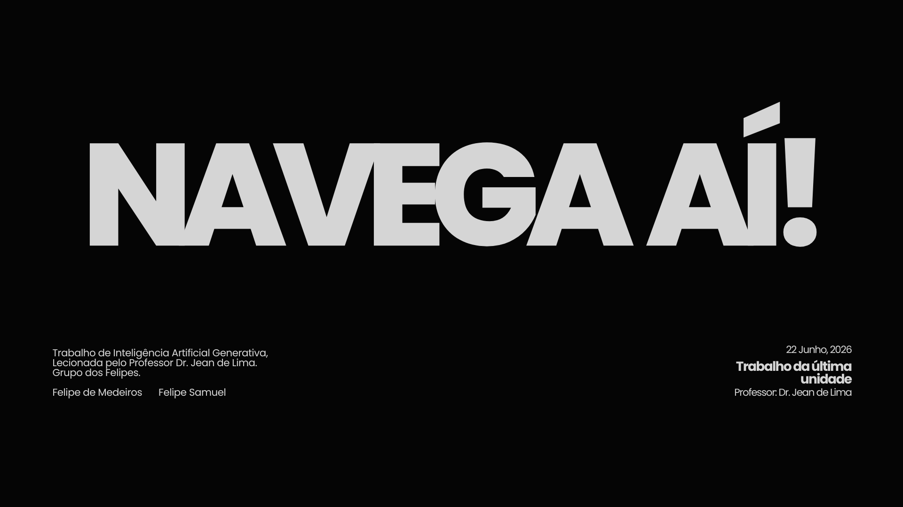

# Navega Aí! 🚢


<div align="center">




</div>

Este projeto tem como objetivo criar um RAG (Retrieval-Augmented Generation) para termos burocráticos da Universidade Federal do Rio Grande do Norte (UFRN). O projeto foi construido em python e utiliza a biblioteca LangChain para a implementação do RAG.

## Estrutura do Projeto
- `config/`: Contém o arquivo de configuração do projeto.
- `data/`: Contém os dados brutos e processados.
- `rag/`: Contém o código para o RAG.
- `ui/`: Contém o código para a interface do usuário.

## Como usar
### Usar localmente

1. Clone o repositório:
   ```bash
   git clone https://www.github.com/felipe-sbm/navega-ai-ufrn.git

   cd navega-ai-ufrn
   ```

2. Instale as dependências:
   ```bash
    python3 -m venv venv

    source venv/bin/activate  # no Windows use o `venv\Scripts\activate`

    pip install -r requirements.txt
   ```

3. Execute o script principal:
   ```bash
   streamlit run main.py
   ```

### Alternativa em núvem
> Ou você também pode baixar o nosso notebook (na pasta notebook), e executar o código pelo Colab, caso ache que seja melhor!

## Dados
Todos os dados foram coletados a partir de documentos oficiais da UFRN, como regulamentos, manuais e portarias. Os dados foram processados e organizados para facilitar a consulta.

Os dados burocraticos são relacionados a alunos de nível técnico e pós-graduação, já que não são tão comuns de se encontrar na internet. Como o suporte da UFRN demora, eu decidi fazer isso como projeto sugerido pelo professor [Jean Mário Moreira de Lima (@jeanmmlima)](https://github.com/jeanmmlima)

## A equipe
- [Felipe SBM](https://github.com/felipe-sbm)
- [Felipe de Medeiros](https://github.com/felipepotigol)

## A banca avaliadora
Tivemos uma banca avaliadora composta por dois professores da UFRN, que nos ajudaram a melhorar o projeto e nos deram feedbacks para atualizações. Os professores envolvidos foram:

- [Jean Mário Moreira de Lima](https://github.com/jeanmmlima) (professor de IA Generativa)
- [Patrick Cesar Alves Terrematte](https://github.com/terrematte) (professor de Aprendizado Profundo)

 Agradeço, em nome da equipe, aos professores que participaram da banca avaliadora, vocês foram de cunho essencial para o sucesso do projeto. Muito obrigado!